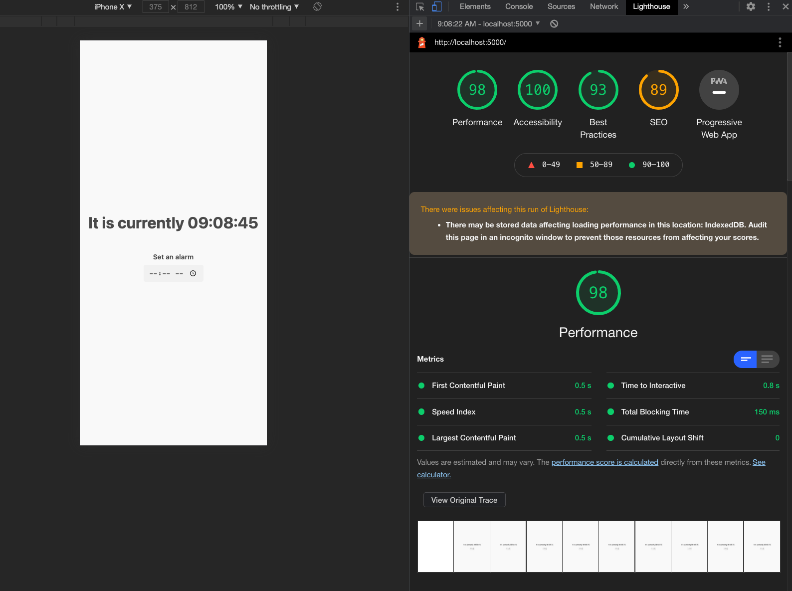

# alarm clock (my own react hooks implementation)

## Installation

For development, you will need [ Node.js ](https://nodejs.org/) and a node package manager like Yarn or [NPM](https://npmjs.org/), installed in your environment.

3rd party dependencies I've used are
  - [Vite](https://vitejs.dev/) (build tool/module loader)
  - [sakura css](https://github.com/oxalorg/sakura)


### install dependencies
    $ npm install

### build command
    $ npm run build

### Running production build
    $ npm run serve
  defaults to `http://localhost:5000/`

### running dev server
    $ npm run dev
  defaults to `http://localhost:3000/`

---
## Project structure
```
.
├── README.md
├── app.js
├── dist
│   ├── assets
│   │   ├── {optimized}.svg
│   │   ├── {optimized}.css
│   │   └── {optimized}.js
│   └── index.html
├── favicon.svg
├── index.html
├── package-lock.json
├── package.json
├── style.css
└── utils
    └── framework.js
```
---

## My approach building this app
The assignment was open ended to allow me to flex my skillset so I decided to write a naive implementation of react js including its useState and useEffects apis.

Assignment recommended timeframe was 3 hours

I implemented these by taking advantage of javascript closures to make stateful functions to be used in components (which are just functions themselves) without relying on centralized application state.

I used approach rather than using a centralized app state because its easier to guard against different parts of the application modifying state that other parts of the application may be relying on. ***this is overkill for an alarm clock app, but figured I'd flex my skills***

As for the styling I kept it simple and used the native html time input element for accessibility for keyboard navigation as well as screen readers.




## TODO
- Styling could def be improved
- Add feature to clear alarm
- Add feature to allow for multiple alarms
- Alarm should play a sound instead of an alert box.
- The framework should have a better solution for repaints to the dom, currently have it repainting every second which works in hte context of a clock app, but would ideally have some sort of diffing function to determine when to re-render.